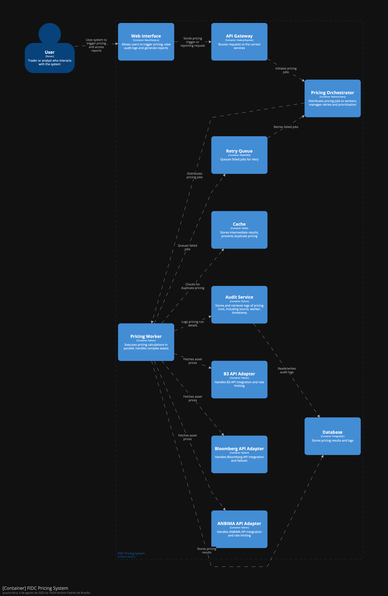

# Arquitetura do Sistema de Precificação Distribuída FIDC - Desafio 1

Este documento descreve a arquitetura proposta para o sistema de precificação distribuída de ativos FIDC, projetado para atender aos desafios de escalabilidade, auditoria e integração com múltiplas fontes externas.

## Componentes Principais

- **Web Interface**: Interface React/Node.js para usuários dispararem precificação, consultar relatórios e auditoria.
- **API Gateway**: Roteia requisições para os serviços internos.
- **Pricing Orchestrator**: Orquestrador Python/Celery que distribui tarefas de precificação para múltiplos workers, gerenciando retries, priorização e rate limits.
- **Pricing Worker**: Workers Python que executam cálculos em paralelo, inclusive para ativos complexos.
- **Audit Service**: Serviço Python que registra logs detalhados de cada precificação (fonte, worker, timestamp, parâmetros), garantindo rastreabilidade para compliance CVM.
- **Cache (Redis)**: Armazena resultados intermediários e previne duplicidade de precificação.
- **Retry Queue (RabbitMQ)**: Gerencia jobs que falharam, permitindo reprocessamento automático.
- **Database (PostgreSQL)**: Persistência dos resultados, logs e histórico de precificação.
- **Adapters de APIs Externas**: Integração dedicada para ANBIMA, Bloomberg e B3, cada um com lógica de rate limiting e failover.

## Fluxos e Estratégias

- O usuário dispara a precificação via Web Interface, que passa pelo API Gateway.
- O Pricing Orchestrator distribui os ativos entre os Pricing Workers, respeitando rate limits e priorização de fontes.
- Cada worker consulta o cache antes de precificar, evitando duplicidade.
- Workers integram-se com as APIs externas via adapters, que tratam rate limits e falhas (ex: Bloomberg instável).
- Resultados e logs são persistidos no banco de dados e auditados pelo Audit Service.
- Jobs com erro são enviados para a Retry Queue e reprocessados automaticamente.

## Como cada requisito do desafio é atendido

- **Paralelização**: Pricing Orchestrator e múltiplos Pricing Workers permitem processamento distribuído e rápido.
- **Rate Limiting e Falhas**: Adapters dedicados para cada API controlam limites e implementam failover.
- **Zero duplicidade**: Cache garante que cada ativo seja precificado uma única vez.
- **Auditoria CVM**: Audit Service registra todos os detalhes de cada precificação.
- **Infraestrutura escalável**: Workers, filas e cache podem ser dimensionados conforme demanda.

## Estruturas de Dados Principais

- **Ativo**: status, fonte utilizada, timestamp, worker responsável, resultado, erro (se houver).
- **Log de Auditoria**: histórico completo de precificação, fonte, parâmetros, versão do algoritmo.
- **Fila de Tarefas**: controle de distribuição e processamento dos ativos.

## Estimativa de Infraestrutura

- Pricing Orchestrator: 1+ instância(s) redundantes
- Pricing Workers: 30-50 instâncias (ajustável)
- Cache: Redis
- Retry Queue: RabbitMQ
- Database: PostgreSQL

Este sistema foi projetado para garantir alta disponibilidade, performance, rastreabilidade e compliance regulatório, suportando o crescimento acelerado da operação FIDC.

---

## Diagrama da Architetura

