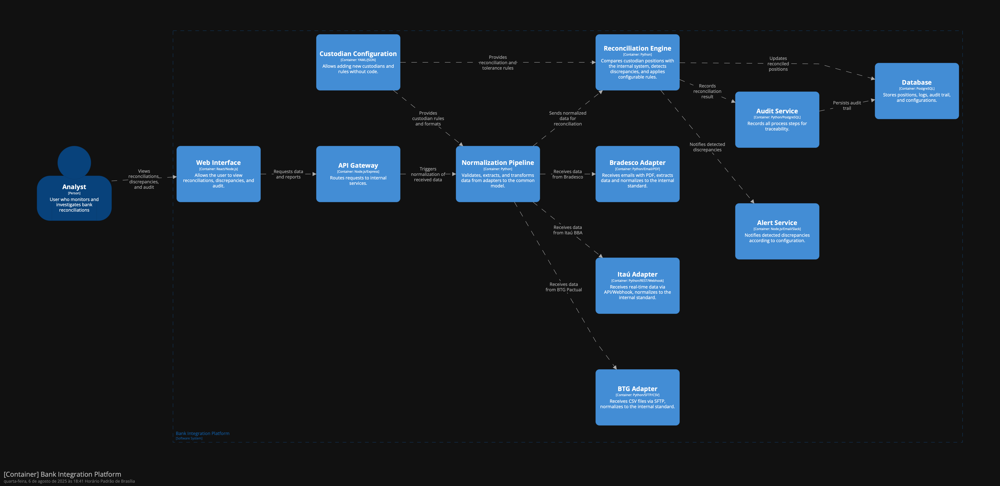

# Integração com Ecossistema Bancário

## Visão Geral

A plataforma de integração bancária da XCapital foi projetada para automatizar a reconciliação diária de posições com múltiplos custodiantes, abstraindo diferenças de formato, detectando divergências automaticamente e permitindo fácil configuração de novos bancos sem necessidade de código.

## Padrão de Integração

- **Adapters de Custódia**: Cada custodiante possui um adapter dedicado que converte o formato original (SFTP+CSV, REST+Webhook, Email+PDF) para um modelo de dados comum (ex: JSON padronizado).
- **Pipeline de Normalização**: Todos os dados recebidos passam por um pipeline que valida, extrai e transforma para o padrão único, facilitando o processamento e comparação.

## Motor de Reconciliação

- **Algoritmo de Reconciliação**: Compara posições reportadas pelos custodiantes com o sistema interno, identificando divergências por ativo, valor, data e custodiante.
- **Regras de Negócio Configuráveis**: Permite definir tolerâncias, exceções e critérios de alerta sem alterar o código.

## Sistema de Alertas

- **Notificações Automáticas**: Divergências são notificadas via email, dashboard ou integração com sistemas de incidentes (ex: Slack, PagerDuty).
- **Alertas Configuráveis**: O usuário pode definir quais tipos de divergência geram alerta, horários e canais de notificação.

## Configuração vs. Código

- **Custodiantes e Formatos**: Novos bancos podem ser adicionados via arquivos de configuração (ex: YAML/JSON), informando formato, protocolo, campos e regras de extração.
- **Regras de Reconciliação**: Tolerâncias, exceções e alertas são parametrizáveis sem necessidade de deploy.

## Auditoria

- **Trilha Completa**: Todas as etapas (recepção, normalização, reconciliação, alerta) são registradas, permitindo rastrear origem, transformação e decisão para cada posição.

---

## Exemplo de Investigação de Divergência

Se um custodiante reporta R$ 50 milhões a mais que o sistema:

1. **Auditoria de Recepção**: Verificar logs de recebimento e normalização do arquivo/report.
2. **Comparação de Dados**: Identificar quais ativos ou posições estão divergentes.
3. **Histórico de Configuração**: Checar se houve alteração de regras, tolerâncias ou campos.
4. **Reprocessamento**: Re-executar pipeline com os dados originais para validar transformação.
5. **Contato com Custodiante**: Se necessário, solicitar detalhamento ou reenvio do arquivo/report.
6. **Registro de Decisão**: Documentar investigação e resolução na trilha de auditoria.

## Diagrama
