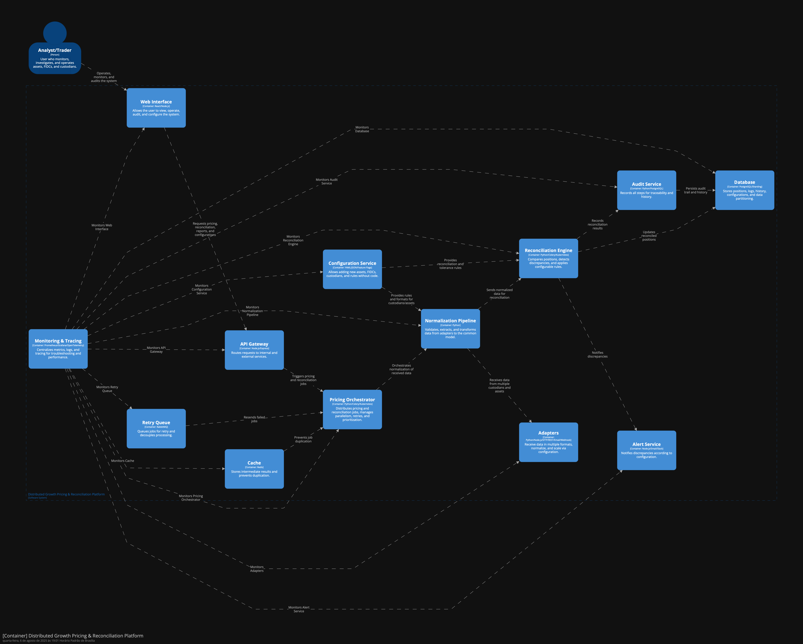

# Desafio 3: Arquitetura para Crescimento

## Roadmap de Migração (3 Fases de 6 Meses)

**Fase 1: Fundamentos de Escalabilidade**
- Separação clara de módulos (adapters, pipelines, orquestradores) em microserviços.
- Introdução de filas e cache distribuído (ex: RabbitMQ, Redis) para desacoplar processamento.
- Refatoração dos adapters para suportar múltiplos formatos e novos tipos de ativos.
- Início da padronização de APIs internas e externas.

**Fase 2: Expansão e Observabilidade**
- Adição de novos custodiantes e tipos de ativos via configuração (YAML/JSON), sem código.
- Implementação de monitoramento centralizado (Prometheus, Grafana) e tracing (OpenTelemetry).
- Migração gradual dos pipelines para processamento paralelo e escalável (ex: Celery, Kubernetes).
- Criação de ambientes de staging para testes de integração e performance.

**Fase 3: Otimização e Internacionalização**
- Suporte a ativos internacionais e múltiplas moedas.
- Arquitetura multi-tenant para múltiplos FIDCs e custodiantes.
- Estratégias de sharding e particionamento de dados históricos.
- Automação de deploys e rollback (CI/CD, feature flags).

## Pontos Críticos que Não Escalam no Sistema Atual

- Adapters monolíticos e hardcoded para cada custodiante.
- Pipeline de normalização sequencial e acoplada.
- Banco de dados único sem particionamento ou replicação.

## Tecnologias Core para a Nova Arquitetura

- **Orquestração:** Kubernetes, Celery, RabbitMQ
- **Adapters:** Python, Node.js, APIs REST, Webhooks, SFTP, Email
- **Monitoramento:** Prometheus, Grafana, OpenTelemetry
- **Persistência:** PostgreSQL (com sharding), Redis (cache)
- **Configuração Dinâmica:** YAML/JSON, Feature Flags
- **CI/CD:** GitHub Actions, ArgoCD

## Estratégia de Dados (Histórico de 7 Anos)

- Migração incremental do histórico para data lakes ou bancos particionados.
- Utilização de ETL para normalizar dados antigos no novo modelo.
- Separação entre dados quentes (recentes) e frios (histórico) para performance.
- Backup e versionamento contínuo dos dados migrados.

## Riscos Técnicos e Mitigações

| Risco | Mitigação |
|-------|-----------|
| Downtime na migração | Blue/green deploy, ambientes de staging, rollback automatizado |
| Inconsistência de dados | Testes automatizados de ETL, validação cruzada entre sistemas |
| Falta de expertise | Treinamento hands-on, documentação, pair programming |
| Escalabilidade de adapters | Refatoração para microserviços, uso de filas e paralelismo |
| Performance do banco | Sharding, replicação, uso de cache |

## Perguntas Estratégicas

**Como testar a nova arquitetura sem impactar produção?**
- Utilizar ambientes de staging idênticos à produção.
- Testes automatizados de integração e carga.
- Feature flags para liberar funcionalidades gradualmente.
- Shadow traffic: replicar requisições reais para o novo sistema sem afetar usuários.

**Critério para migrar vs. refatorar cada módulo?**
- Migrar: módulos acoplados, com baixo reuso e difícil manutenção.
- Refatorar: módulos já desacoplados, com lógica de negócio estável e fácil adaptação.
- Avaliar impacto, custo e risco de cada abordagem.

**Como treinar o time nas novas tecnologias?**
- Workshops práticos e sessões de pair programming.
- Documentação clara e exemplos reais.
- Rotação de funções para expor todos aos novos componentes.
- Incentivo à certificação e cursos online.

## Diagrama
